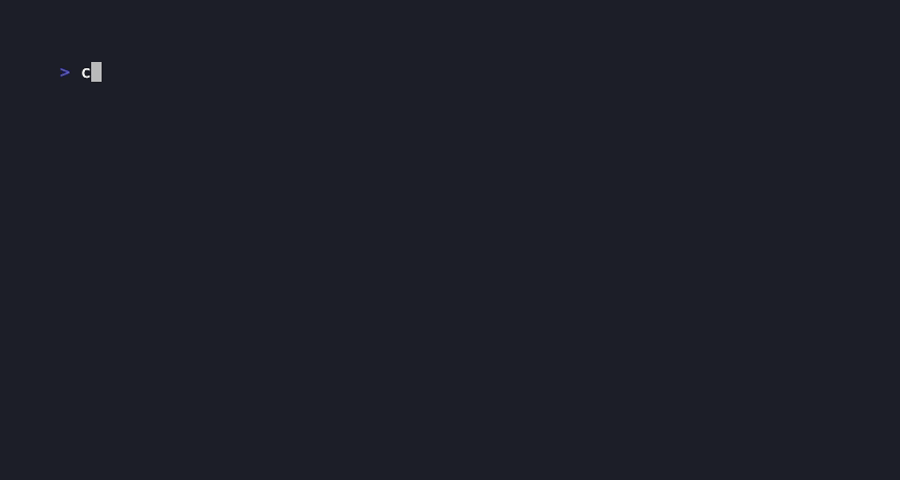

# Agent Evaluation

## The test that every eval framework skips

You changed a prompt. Your evals still pass.
But your agent's tool accuracy dropped from 84% to 70%.

Is that a real regression? Or is it LLM run-to-run noise?

Threshold testing cannot answer that question.
agent-eval can.

Run your agent 50x on version A, 50x on version B.
Get a p-value, an effect size, and a 95% confidence interval
on whether behavior actually shifted.

```
p=0.003, Cohen's d=-0.61 -> REGRESSED (deploy blocked)
p=0.410, Cohen's d=0.021 -> STABLE (safe to ship)
```



[](https://pypi.org/project/agent-regress-cli/)
[](https://www.npmjs.com/package/agent-regress-npm-cli)
[](LICENSE)
[](https://github.com/RudrenduPaul/agent-eval/actions/workflows/ci.yml)

[](https://api.securityscorecards.dev/projects/github.com/RudrenduPaul/agent-eval)

> **Market context:** Promptfoo, one of the most widely used open-source LLM eval frameworks, was [acquired by OpenAI in March 2026](https://techcrunch.com/2026/03/09/openai-acquires-promptfoo-to-secure-its-ai-agents/), staying open source but folding its team into OpenAI's Frontier platform. agent-eval is Apache 2.0-licensed, self-hostable, and has no commercial dependency. The statistical core (Mann-Whitney U, bootstrap CI, Cohen's d) will never be paywalled.

---

## Install

```bash
pip install agent-regress-cli
# or
uv add agent-regress-cli
```

Prefer Node/npx? A thin CLI wrapper is also published as [`agent-regress-npm-cli`](https://www.npmjs.com/package/agent-regress-npm-cli) on npm (it shells out to this same Python package, so Python still needs to be installed):

```bash
npx agent-regress-npm-cli --help
```

---

## Why not DeepEval, Promptfoo, or Braintrust?

| Capability | Agent Evaluation | DeepEval | Braintrust | Promptfoo |
|---|---|---|---|---|
| Statistical version comparison (p-values) | **Yes** | No | No | No |
| Effect size reporting (Cohen's d) | **Yes** | No | No | No |
| Bootstrap 95% confidence intervals | **Yes** | No | No | No |
| Distributional shift detection | **Yes** | No | No | No |
| Tau-bench pass^k harness (k=1,4,8) | **Yes** | No | No | No |
| GAIA Level 1-3 split harness | **Yes** | No | No | No |
| SWE-bench scaffold score harness | **Yes** | No | No | No |
| Self-hostable, zero SaaS required | **Yes** | Partial | No | Yes |
| Sample size warnings | **Yes** | No | No | No |
| Core license | Apache 2.0 | MIT | Proprietary | MIT† |
| Requires cloud account | No | Optional | Yes | No |
| Test type | Distributional | Threshold | Threshold | Threshold |

†Promptfoo acquired by OpenAI, March 2026; remains open source under its current license.

DeepEval tests whether an individual agent response clears a quality bar. Agent Evaluation tests whether behavior changed significantly between two agent versions, a different statistical question that threshold testing cannot answer. The scipy Mann-Whitney U call at the core is one line, so any SaaS eval platform can add it. What accumulates over time through production use is version-specific regression history and a community-maintained benchmark leaderboard with independent result verification.

---

## Real regressions statistical testing catches that threshold testing misses

**LangGraph**

- [#5243](https://github.com/langchain-ai/langgraph/pull/5243): a new typed `context=` API replaced untyped `config['configurable']`. A single run on either invocation style still clears a threshold check; only a version-A-vs-B comparison shows whether the switch changed measured behavior.
- [#4486](https://github.com/langchain-ai/langgraph/pull/4486): node/task-level result caching can silently mask repeated-sampling variance. Threshold checks don't care whether a result came from cache; a statistical comparison depends on genuinely independent samples, so `agent-eval` added cache-busting to protect that assumption.

**OpenAI Agents SDK**

- [#2463](https://github.com/openai/openai-agents-python/pull/2463): agent-as-tool calls were silently dropping the parent run's `RunConfig`. The nested call still returns a normal-looking response, so a single-response check clears; only inspecting config propagation across runs reveals the regression.
- [#2214](https://github.com/openai/openai-agents-python/pull/2214): image/audio/file tool outputs were silently downgraded to text-only. A text-only threshold scorer has no way to notice a dropped attachment.

**CrewAI**

- [#6134](https://github.com/crewAIInc/crewAI/pull/6134): a security fix for file tools leaking absolute filesystem paths in responses. A quality scorer checks whether the answer is correct, not whether it also leaks a path, so the leak clears the bar.
- [#6236](https://github.com/crewAIInc/crewAI/pull/6236): tools gained an optional Pydantic `output_schema`, moving from unstructured `str()` output to structured JSON. Both the old and new format can look "reasonable" to a threshold scorer even though the schema changed underneath.

These are the regressions that motivated this project. Full detail on all 14 individually-documented PRs (drawn from a 29-PR, 239-row validation campaign across LangGraph, CrewAI, and the OpenAI Agents SDK) is in [docs/pr-analysis.md](docs/pr-analysis.md).

---

## The problem this solves

You changed a prompt. Or switched from GPT-4o to GPT-4o-mini to cut costs. Or a dependency updated silently. Your evals still pass, because they test individual responses against fixed thresholds. They don't detect whether behavior shifted across the whole distribution.

A 3-point drop in accuracy might be noise from LLM variance. Or it might be a real regression. Without statistical testing you cannot tell which. Teams either ignore small drops and miss real problems, or escalate everything and drown in false alarms.

Agent Evaluation answers the distributional question with a p-value and effect size:

```
============================================================
agent-regress Report -- tool_accuracy
============================================================
Verdict:    REGRESSED
p-value:    0.0031
Cohen's d:  -0.610
95% CI:     [-0.221, -0.067]

Version A:  0.8400 +/- 0.0601  (n=50)
Version B:  0.7000 +/- 0.0903  (n=50)
Delta:      -0.1400
============================================================
```

When CI fails, the assertion error gives the deploy-blocking message:

```
AssertionError: REGRESSED: tool_accuracy dropped 16.7%
(p=0.003, Cohen's d=-0.61, 95% CI [-0.22, -0.07])
Version A: 0.840 +/- 0.060  (n=50)
Version B: 0.700 +/- 0.090  (n=50)
```

When nothing changed:

```
Verdict:    STABLE
p-value:    0.4100
Cohen's d:  0.021
```

DeepEval, Promptfoo, and Braintrust test whether individual responses meet thresholds. None of them answer whether a version's behavior distribution shifted significantly from the last. Agent Evaluation addresses that specific statistical question, which threshold testing cannot answer.

---

## Quickstart

### In 30 seconds (CLI)

Already have per-run scores from your own harness? Point the CLI at two JSON arrays of scores, one per version:

```bash
pip install agent-regress-cli

agent-regress compare \
  --version-a-results v1_scores.json \
  --version-b-results v2_scores.json \
  --metric tool_accuracy

# ============================================================
# agent-regress Report -- tool_accuracy
# ============================================================
# Verdict:    REGRESSED
# p-value:    0.0000
# Cohen's d:  -2.193
# 95% CI:     [-0.213, -0.148]
#
# Version A:  0.8470 +/- 0.0525  (n=50)
# Version B:  0.6685 +/- 0.1025  (n=50)
# Delta:      -0.1786
# ============================================================
```

Add `--json --fail-on-regression` to get clean, parseable output and a non-zero exit code on `REGRESSED`, for wiring straight into CI.

### In your code (Python API)

Driving the agent yourself instead of pre-computing scores? Use the Python API:

```python
from agent_regress import compare

# Any callable that takes a test case dict and returns a score 0.0-1.0
def agent_v1(test_case: dict) -> float:
    ...  # your existing agent

def agent_v2(test_case: dict) -> float:
    ...  # your updated agent

test_suite = [
    {"query": "find SKU for order 8823", "expected": "SKU-4492"},
    # ... more test cases
]

report = compare(
    version_a=agent_v1,
    version_b=agent_v2,
    test_suite=test_suite,
    n_runs=50,
    metric="tool_accuracy",  # use any name except "accuracy" when agents return floats
)

print(report)           # structured output with p-value, CI, effect size
report.assert_stable()  # raises AssertionError if behavior regressed
```

Agent returns text? Pass a scorer or use the built-ins:

```python
from agent_regress import compare, exact_match_scorer, f1_scorer

# exact_match_scorer: 1.0 if str(output).strip() == str(expected).strip()
# f1_scorer: token-level F1 (multiset — handles repeated tokens correctly)
report = compare(
    version_a=agent_v1,
    version_b=agent_v2,
    test_suite=test_suite,
    n_runs=50,
    scorer=exact_match_scorer,  # test_case must have an "expected" key
)
```

Or write your own:

```python
def my_scorer(output: str, test_case: dict) -> float:
    return 1.0 if output.strip() == test_case["expected"] else 0.0

report = compare(..., scorer=my_scorer)
```

---

## Add to CI: fail the build on regression

Two patterns. Pick one.

**`report.assert_stable()`** — inline, after you've already called `compare()`:

```python
# test_regression.py -- add to your existing test suite
from agent_regress import compare

def test_no_regression():
    report = compare(
        version_a=production_agent,
        version_b=staging_agent,
        test_suite=load_test_suite(),
        n_runs=50,
    )
    report.assert_stable(
        p_threshold=0.05,  # act on changes at p < 0.05
        min_effect=0.2,    # Cohen's d threshold -- ignore noise below 0.2
    )
```

**`RegressionGate`** — reusable gate object, useful when you run multiple comparisons with the same thresholds:

```python
from agent_regress import compare, RegressionGate

gate = RegressionGate(p_threshold=0.05, min_effect=0.2)

def test_tool_accuracy():
    report = compare(version_a=prod, version_b=staging, test_suite=suite, n_runs=50)
    gate.check(report)  # raises AssertionError on regression; warns if n < 30

def test_routing_accuracy():
    report = compare(version_a=prod, version_b=staging, test_suite=routing_suite, n_runs=50)
    gate.check(report)
```

Both patterns: warn (not fail) when `n < 30` per version, and treat `n < 10` as insufficient data and skip the gate. This CI-gate threshold (30) is intentionally lower than `compare()`'s own general low-power warning (`n < 50`, see [FAQ](#faq)) — it exists to stop a genuinely too-small sample from silently gating a build, not to guarantee 80% statistical power the way the 50-run recommendation does.

```bash
uv run pytest test_regression.py
```

---

## Statistical methods

Agent Evaluation uses three statistical tests, applied in combination:

**Mann-Whitney U** compares two score distributions without assuming normality. LLM scores are not Gaussian. The U test is distribution-free and robust to the long tails and bimodal distributions that appear in real agent outputs.

**Bootstrap confidence intervals** (1,000 resamples, seed=42) give a 95% CI on the mean score delta. The CI tells you how large the shift was: a CI of [-0.22, -0.07] means you can be 95% confident the true per-run accuracy drop is between 7 and 22 percentage points.

**Cohen's d** (pooled standard deviation) separates statistical significance from operational significance. A shift at p=0.001 with d=0.04 is real but meaningless. A shift at p=0.06 with d=0.5 is operationally large but requires more data to confirm. The default CI gate acts only when both p < 0.05 and d >= 0.2.

See [docs/statistical-methods.md](docs/statistical-methods.md) for the full methodology.

---

## Benchmarks

Statistical test overhead is the time to run the comparison itself, not the agent calls. Agent calls are the bottleneck; the statistics are not.

Measured on Apple M3 Pro, Python 3.14, scipy 1.15, numpy 2.2:

| Operation | n=50 per version | n=1,000 per version |
|---|---|---|
| Mann-Whitney U | **0.34ms** | **0.47ms** |
| Bootstrap CI (1,000 resamples) | **26ms** | **31ms** |
| Full compare() statistical overhead | **~27ms** | **~32ms** |

See [docs/benchmarks.md](docs/benchmarks.md) to reproduce.

---

## Integration matrix

| Framework | Status | Install |
|---|---|---|
| LangGraph | Shipped (v0.1) | `pip install agent-regress-cli[langgraph]` |
| OpenAI Agents SDK | Shipped (v0.1) | `pip install agent-regress-cli[openai-agents]` |
| CrewAI | Shipped (v0.1) | `pip install agent-regress-cli[crewai]` |
| LangChain LCEL | Shipped (v0.1) | `pip install agent-regress-cli[langchain]` |
| AutoGen | Planned (v0.3) | |
| Vercel AI SDK (TypeScript) | Planned (v0.4) | |

Comparing two *installed versions* of the same framework (rather than two
in-process configurations)? See
[docs/cross-version-comparison.md](docs/cross-version-comparison.md) for the
`subprocess_runner()` pattern.

**A note on the `[crewai]` extra:** CrewAI's own memory/knowledge/RAG backend can pull in ChromaDB, which currently has an unpatched critical CVE ([GHSA-f4j7-r4q5-qw2c](https://github.com/advisories/GHSA-f4j7-r4q5-qw2c)) affecting any ChromaDB server run with `trust_remote_code=True` and exposed to the network. `agent-eval` never starts, configures, or exposes a ChromaDB server itself, so this only matters if your own `Crew` does — don't run a network-exposed ChromaDB instance with `trust_remote_code=True` until a fix ships.

---

## Standard benchmarks

Agent Evaluation ships harnesses for the three standard agent benchmarks:

**Tau-bench pass^k** measures reliability across k independent attempts. Single-run benchmarks miss degradation: an agent that succeeds 60% of the time at k=1 reaches 99.93% at k=8. The k=1 vs k=8 curve is the signal.

```python
from agent_regress.benchmarks.tau_bench import TauBenchHarness

harness = TauBenchHarness(agent=my_agent, dataset=tau_bench_dataset)
results = harness.evaluate(k_values=[1, 4, 8])
```

**GAIA Level 1-3 split** stratifies by task difficulty. Overall accuracy hides per-difficulty regressions: a prompt change that helps Level 1 often hurts Level 3.

```python
from agent_regress.benchmarks.gaia import GAIAHarness

harness = GAIAHarness(agent=my_agent, dataset=gaia_dataset)
results = harness.evaluate()  # returns list[GAIALevelResult], one per level
for r in results:
    print(f"Level {r.level}: {r.accuracy:.3f}  ({r.n_correct}/{r.n_questions})")
```

**SWE-bench scaffold score** isolates framework contribution from model contribution.

```python
from agent_regress.benchmarks.swebench import SWEBenchHarness

harness = SWEBenchHarness(agent=my_agent, dataset=swe_dataset)
result = harness.evaluate()
print(f"scaffold pass rate: {result.scaffold_pass_rate:.3f}  ({result.n_resolved}/{result.n_instances})")
```

See [leaderboard/README.md](leaderboard/README.md) to submit results.

---

## Try it in Docker

```bash
git clone https://github.com/RudrenduPaul/agent-eval
cd agent-eval
docker compose up
```

Starts two services:

- **web** (`http://localhost:8080`) — leaderboard UI served by `web/serve.py`, reading `leaderboard/results/*.json`
- **example** — runs `examples/01-basic-comparison/example.py` and prints the comparison report to stdout

Good for verifying the install works and seeing the leaderboard UI before wiring agent-regress into your own agent.

---

## Security

- **Supply chain:** SLSA Level 2 via GitHub Actions provenance. All releases signed with Sigstore. SBOM attached to every GitHub Release.
- **Vulnerability scanning:** Trivy scans on every CI run (HIGH/CRITICAL only, exit on unfixed). CodeQL static analysis on every push.
- **Dependency pinning:** Dependabot keeps all GitHub Actions and Python dependencies current.
- **Disclosure:** [SECURITY.md](SECURITY.md) — report vulnerabilities privately via GitHub Security Advisories.

---

## Leaderboard

The `leaderboard/` directory version-controls Tau-bench pass^k, GAIA, and SWE-bench results across models and frameworks. Submit by opening a PR with a JSON file matching `leaderboard/schema.json`. Results are independently reproduced before merging.

See [leaderboard/README.md](leaderboard/README.md).

---

## FAQ

**What is agent-eval, and what makes it different from a normal LLM eval framework?**

Agent Evaluation is a statistics library for detecting whether an agent's behavior actually changed between two versions. Run the same test suite 50 times on version A and 50 times on version B, and it reports a p-value (Mann-Whitney U), an effect size (Cohen's d), and a bootstrap 95% confidence interval on the score delta. Most eval frameworks check whether a single response clears a fixed quality threshold. Agent Evaluation instead answers a distributional question: did the score distribution shift significantly, or is a change just LLM-run-to-run noise.

**How do I install it, and which platforms does it support?**

`pip install agent-regress-cli` or `uv add agent-regress-cli`. It requires Python 3.10 through 3.13 (per the classifiers in `pyproject.toml`) and has no OS-specific code, so it runs anywhere those Python versions run. Node users can call `npx agent-regress-npm-cli --help`, a thin wrapper that shells out to this same Python package, so Python still needs to be installed alongside Node.

**How does it compare to DeepEval, Promptfoo, or Braintrust?**

The full breakdown is in the [comparison table](#why-not-deepeval-promptfoo-or-braintrust) above. In short: DeepEval, Promptfoo, and Braintrust all test whether an individual response clears a fixed quality bar. None of the three report a p-value, an effect size, or a bootstrap confidence interval on whether behavior shifted between two versions, which is the specific statistical question agent-eval is built to answer.

**I ran a comparison and got a warning about insufficient statistical power, or a verdict of INSUFFICIENT_DATA. What does that mean?**

The library warns (but does not fail) when either version has fewer than 50 runs, since that is the sample size needed for reliable detection of a moderate effect (Cohen's d of 0.2) at 80% power. Below 10 runs per version, it returns `INSUFFICIENT_DATA` instead of a REGRESSED/STABLE/IMPROVED verdict, since the sample is too small to trust any statistical conclusion. Re-run with `n_runs=50` or higher for a verdict you can act on.

**Does agent-eval call my LLM or manage API keys for me?**

No. `compare()` takes two callables you provide, `version_a` and `version_b`, and runs your existing agent code against your test suite. Agent Evaluation never makes a model call itself, and the stats module (`src/agent_regress/stats/`) is required to stay pure Python and scipy with no LLM calls, so the statistical core has no network dependency and nothing to configure credentials for.

**Which agent frameworks does it integrate with today?**

LangGraph, the OpenAI Agents SDK, CrewAI, and LangChain LCEL are shipped as of v0.1 (see the [integration matrix](#integration-matrix) above), each installable as an extra, e.g. `pip install agent-regress-cli[langgraph]`. AutoGen and a Vercel AI SDK (TypeScript) integration are planned but not yet shipped.

**Can I use agent-eval commercially, and what license is it under?**

Yes. It is licensed under Apache License 2.0, which permits commercial use, modification, and distribution, and includes an explicit patent grant. You need to preserve the copyright and license notices and state any changes you make; there is no warranty. See [LICENSE](LICENSE) for the full text.

---

## Contributing

- Read [CONTRIBUTING.md](CONTRIBUTING.md) before opening a PR
- Good first issues are labeled in GitHub
- Stats module (`src/agent_regress/stats/`) must stay pure Python + scipy — no LLM calls, ever
- All PRs require 95% coverage on `stats/`, 80% overall

GitHub Discussions for design questions.

Apache 2.0. Contributions welcome.

---

## Cite this work

If you use Agent Evaluation in research, please cite:

```bibtex
@software{paul2026agenteval,
  author = {Paul, Rudrendu and Nandy, Sourav},
  title = {Agent Evaluation: Statistical Regression Testing for LLM Agents},
  year = {2026},
  url = {https://github.com/RudrenduPaul/agent-eval},
  license = {Apache-2.0}
}
```

---

*Built by Rudrendu Paul and Sourav Nandy*
